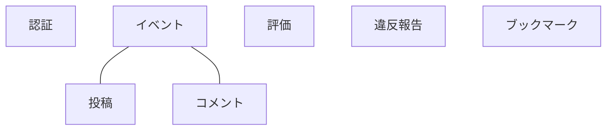
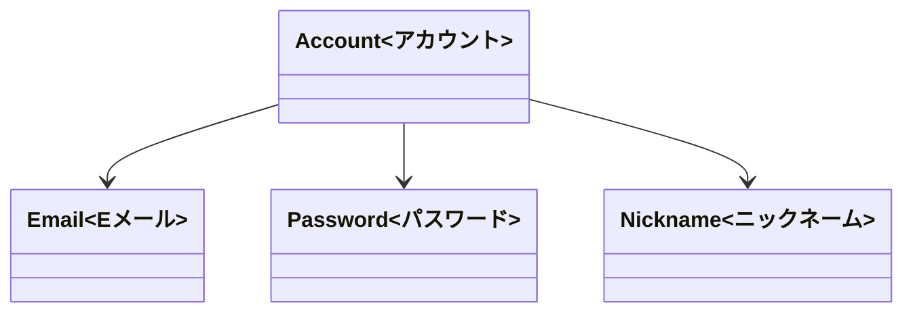

# コンテキストマップ

```mermaid
flowchart TD
  Auth["認証"]
  Event["イベント"]
  Post["投稿"]
  Comment["コメント"]
  Rate["評価"]
  ViolationReport["違反報告"]
  Bookmark["ブックマーク"]

  Event --- Post & Comment
```

## 認証ドメイン

```mermaid
classDiagram
  class Account~アカウント~
  class Email~Eメール~
  class Password~パスワード~
  class Nickname~ニックネーム~
  Account --> Email
  Account --> Password
  Account --> Nickname
```
